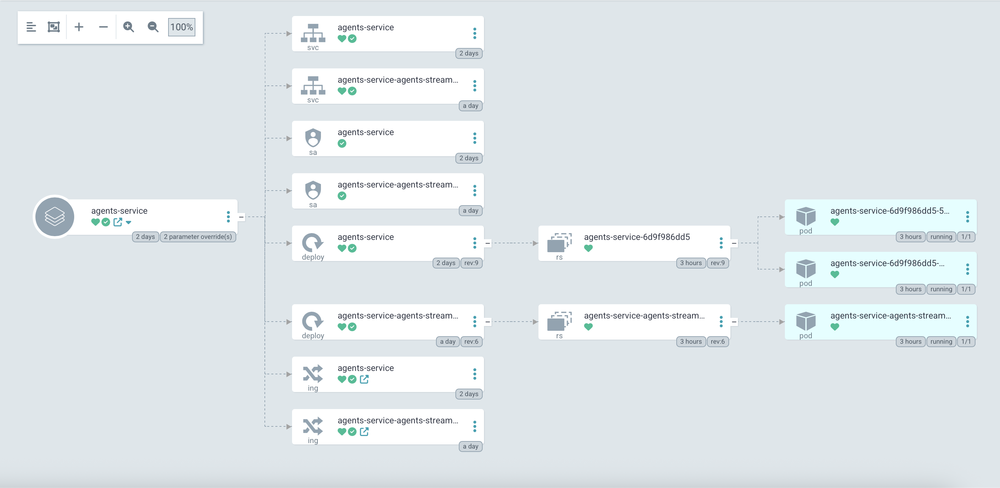

# 🧰 Kubernetes AI Agents Service

[](https://github.com/richardr1126/k8s-agents-service/blob/main/LICENSE)

A Kubernetes deployment of an AI agents service built with LangGraph, FastAPI and Streamlit, featuring comprehensive Helm charts with dual-architecture deployment and GitOps integration.

This project extends [JoshuaC215's agent-service-toolkit](https://github.com/JoshuaC215/agent-service-toolkit) with Kubernetes deployment capabilities, including dual Helm charts for service/UI separation, ArgoCD integration, YugabyteDB support, and multi-architecture container builds.

> **⚠️ Important Notice**: This project is currently in development and is **not fully featured for production** use. While it provides a solid foundation for Kubernetes deployment of AI agents, additional hardening, monitoring, and operational considerations may be needed for production environments.

## 🙏 Acknowledgments

This project is built upon the excellent foundation provided by [JoshuaC215's AI Agent Service Toolkit](https://github.com/JoshuaC215/agent-service-toolkit). Special thanks to @JoshuaC215 for creating the original comprehensive toolkit that demonstrates best practices for LangGraph-based agent development.

## ✨ What's New in k8s-agents-service

This fork adds Kubernetes deployment capabilities on top of the original toolkit:

- **🎯 Kubernetes-Native**: Dual Helm charts with subchart architecture for service and UI components
- **🔄 GitOps Ready**: ArgoCD application manifests for automated deployments  
- **🗄️ YugabyteDB Integration**: Distributed SQL database with pgvector extensions for RAG capabilities
- **🏗️ Multi-Architecture**: Docker builds for both AMD64 and ARM64 architectures across service and streamlit containers
- **📦 Container Registry**: Automated builds and publishing to GitHub Container Registry with separate image streams
- **🔧 Deployment Scripts**: Comprehensive deployment automation with database setup, secrets management, and dependency updates

## Overview

### Core Features (from original toolkit)

1. **LangGraph Agent and latest features**: A customizable agent built using the LangGraph framework. Implements the latest LangGraph v0.3 features including human in the loop with `interrupt()`, flow control with `Command`, long-term memory with `Store`, and `langgraph-supervisor`.
1. **FastAPI Service**: Serves the agent with both streaming and non-streaming endpoints.
1. **Advanced Streaming**: A novel approach to support both token-based and message-based streaming.
1. **Streamlit Interface**: Provides a user-friendly chat interface for interacting with the agent.
1. **Multiple Agent Support**: Run multiple agents in the service and call by URL path. Available agents and models are described in `/info`
1. **Asynchronous Design**: Utilizes async/await for efficient handling of concurrent requests.
1. **Content Moderation**: Implements LlamaGuard for content moderation (requires Groq API key).
1. **RAG Agent**: RAG implementation using PGVector with YugabyteDB - see [docs](docs/RAG_Assistant.md).
1. **Feedback Mechanism**: Includes a star-based feedback system integrated with LangSmith.
1. **Docker Support**: Includes Dockerfiles and a docker compose file for easy development and deployment.
1. **Testing**: Includes robust unit and integration tests for the full repo.

### New Kubernetes Features

1. **Dual Helm Charts**: Separate charts for service (`agents-service`) and UI (`agents-streamlit`) with subchart architecture
1. **ArgoCD Integration**: GitOps-ready application manifests for automated deployments
1. **YugabyteDB Support**: Enterprise-grade distributed SQL database with pgvector extension support for RAG capabilities
1. **Multi-Architecture Builds**: AMD64 and ARM64 Docker images for both service and streamlit components published to GitHub Container Registry
1. **Automated Deployment Scripts**: Deployment automation with database setup and dependency management
1. **Kubernetes Secrets Management**: Secure handling of API keys and database credentials with enhanced environment configuration

### ArgoCD Diagram



## 🚀 Quickstart

### Local Development (Docker)

```sh
# At least one LLM API key is required
echo 'OPENAI_API_KEY=your_openai_api_key' >> .env

# Run with docker compose watch for live reloading
docker compose watch
```

### Local Development (Python)

```sh
# uv is the recommended way to install dependencies
curl -LsSf https://astral.sh/uv/0.7.19/install.sh | sh

# Install dependencies and run
uv sync --frozen
source .venv/bin/activate
python src/run_service.py

# In another shell
source .venv/bin/activate
streamlit run src/streamlit_app.py
```

### Kubernetes Deployment

```sh
# Clone the repository
git clone https://github.com/richardr1126/k8s-agents-service.git
cd k8s-agents-service

# Configure environment variables
cp helm/.env.example helm/.env
# Edit helm/.env with your API keys and secrets

# Deploy to Kubernetes with YugabyteDB
cd helm
./manual_deploy.sh
```

For ArgoCD deployments, see the `helm/argocd.yaml` manifest.

### Key Files

The repository is structured as follows:

**Core Application:**
- `src/agents/`: Defines several agents with different capabilities
- `src/schema/`: Defines the protocol schema  
- `src/core/`: Core modules including LLM definition and settings
- `src/service/service.py`: FastAPI service to serve the agents
- `src/client/client.py`: Client to interact with the agent service
- `src/streamlit_app.py`: Streamlit app providing a chat interface
- `tests/`: Unit and integration tests

**Kubernetes Deployment:**
- `helm/agents-service/`: Complete Helm chart for the backend service
- `helm/agents-streamlit/`: Dedicated Helm chart for the Streamlit UI (deployed as subchart)
- `helm/argocd.yaml`: ArgoCD application manifest for GitOps
- `helm/manual_deploy.sh`: Deployment script with YugabyteDB setup
- `helm/create_secrets.sh`: Kubernetes secrets management script for both service and streamlit components
- `helm/update_dependencies.sh`: Helm chart dependency management script for subchart updates
- `docker/`: Multi-architecture Dockerfiles for both service and streamlit builds

## Setup and Usage

1. Clone the repository:

   ```sh
   git clone https://github.com/richardr1126/k8s-agents-service.git
   cd k8s-agents-service
   ```

2. Set up environment variables:
   Create a `.env` file in the root directory. At least one LLM API key or configuration is required. See the [`.env.example` file](./.env.example) for a full list of available environment variables, including a variety of model provider API keys, header-based authentication, LangSmith tracing, testing and development modes, and OpenWeatherMap API key.

3. You can now run the agent service and the Streamlit app locally, either with Docker or just using Python. The Docker setup is recommended for simpler environment setup and immediate reloading of the services when you make changes to your code.

### Additional setup for specific AI providers

- [Setting up Ollama](docs/Ollama.md)
- [Setting up VertexAI](docs/VertexAI.md)
- [Setting up RAG with PGVector](docs/RAG_Assistant.md)

### Building or customizing your own agent

To customize the agent for your own use case:

1. Add your new agent to the `src/agents` directory. You can copy `research_assistant.py` or `chatbot.py` and modify it to change the agent's behavior and tools.
1. Import and add your new agent to the `agents` dictionary in `src/agents/agents.py`. Your agent can be called by `/<your_agent_name>/invoke` or `/<your_agent_name>/stream`.
1. Adjust the Streamlit interface in `src/streamlit_app.py` to match your agent's capabilities.


### Database Configuration

This fork uses **YugabyteDB with pgvector** instead of the original PostgreSQL/ChromaDB setup, providing several advantages:

**YugabyteDB Benefits:**
- **Distributed SQL**: Horizontal scaling and high availability out of the box
- **PostgreSQL Compatibility**: Full SQL compliance with familiar PostgreSQL interfaces  
- **Built-in pgvector**: Native vector similarity search for RAG applications
- **Enterprise-Grade**: Reliability and performance features

**RAG Implementation:**
- **PGVector Integration**: Uses `langchain-postgres` with PGVector for vector storage and retrieval
- **Multiple Collections**: Supports multiple knowledge bases (e.g., "richard-projects" collection)
- **Azure OpenAI Embeddings**: Integration with Azure OpenAI's text-embedding-3-large model
- **Automatic Setup**: Database schema and vector extensions are automatically configured

The system supports three database options:
- **YugabyteDB**: Distributed SQL with pgvector extensions (recommended)
- **PostgreSQL**: Traditional PostgreSQL with pgvector extension  
- **SQLite**: Local development and testing

### Handling Private Credential files

If your agents or chosen LLM require file-based credential files or certificates, the `privatecredentials/` has been provided for your development convenience. All contents, excluding the `.gitkeep` files, are ignored by git and docker's build process. See [Working with File-based Credentials](docs/File_Based_Credentials.md) for suggested use.


### Kubernetes Deployment

This repository includes comprehensive Kubernetes deployment capabilities using Helm charts and GitOps with ArgoCD.

#### Prerequisites

- Kubernetes cluster (1.19+)
- Helm 3.x
- YugabyteDB or PostgreSQL database
- Docker registry access (GitHub Container Registry)

#### Environment Configuration

The deployment uses an enhanced environment configuration with separate secrets for different components:

```bash
# Core authentication and database
AUTH_SECRET=your-secret-for-streamlit-auth
ADMIN_POSTGRES_PASSWORD=admin-database-password  
APP_POSTGRES_PASSWORD=application-database-password

# API Keys
OPENROUTER_API_KEY=your-openrouter-key
LANGSMITH_API_KEY=your-langsmith-key  
AZURE_OPENAI_API_KEY=your-azure-openai-key
GITHUB_PAT=your-github-token-for-container-registry
```

#### Quick Deploy with Helm

```sh
# Navigate to helm directory
cd helm

# Copy and configure environment variables
cp .env.example .env
# Edit .env with your API keys, database passwords, and GitHub PAT

# Run the deployment script (includes YugabyteDB setup)
./manual_deploy.sh
```

This script will:
- Build and push multi-architecture Docker images for both service and streamlit to GitHub Container Registry
- Set up YugabyteDB user and database with vector extensions
- Create Kubernetes secrets with your API keys and configuration
- Deploy both agents-service and agents-streamlit applications using Helm with subchart architecture

#### GitOps with ArgoCD

For GitOps deployments, use the included ArgoCD application manifest:

```sh
# Create secrets manually
./create_secrets.sh

kubectl apply -f helm/argocd.yaml
```

#### Manual Helm Deployment

```sh
# Create secrets manually
./create_secrets.sh

# Update chart dependencies (includes agents-streamlit subchart)
./update_dependencies.sh

# Install with Helm
helm install agents-service ./agents-service \
  --set image.repository=ghcr.io/richardr1126/k8s-agents-service \
  --set image.tag=latest \
  --set agents-streamlit.image.repository=ghcr.io/richardr1126/k8s-agents-streamlit \
  --set agents-streamlit.image.tag=latest
```

#### Dual-Chart Architecture

The Kubernetes deployment uses a dual-chart architecture:

- **`agents-service`**: Main Helm chart that deploys the FastAPI backend service
- **`agents-streamlit`**: Subchart that deploys the Streamlit UI application as a separate pod

This architecture provides:
- **Independent Scaling**: Scale UI and backend independently based on demand
- **Separation of Concerns**: UI and backend can be managed, updated, and troubleshot independently  
- **Deployment Flexibility**: Deploy only the backend for API-only deployments using `--set agents-streamlit.enabled=false`
- **Enhanced Security**: Different ingress rules and network policies can be applied to each component

#### Database Support

- **YugabyteDB**: Distributed SQL with vector extensions (recommended)
- **PostgreSQL**: Traditional PostgreSQL with pgvector extension
- **SQLite**: For development only

### Docker Setup

This project includes a Docker setup for easy development and deployment. The `compose.yaml` file defines three services: `postgres`, `agent_service` and `streamlit_app`. The `Dockerfile` for each service is in their respective directories.

For local development, we recommend using [docker compose watch](https://docs.docker.com/compose/file-watch/). This feature allows for a smoother development experience by automatically updating your containers when changes are detected in your source code.

1. Make sure you have Docker and Docker Compose (>=[2.23.0](https://docs.docker.com/compose/release-notes/#2230)) installed on your system.

2. Create a `.env` file from the `.env.example`. At minimum, you need to provide an LLM API key (e.g., OPENAI_API_KEY).
   ```sh
   cp .env.example .env
   # Edit .env to add your API keys
   ```

3. Build and launch the services in watch mode:

   ```sh
   docker compose watch
   ```

   This will automatically:
   - Start a PostgreSQL database service that the agent service connects to
   - Start the agent service with FastAPI
   - Start the Streamlit app for the user interface

4. The services will now automatically update when you make changes to your code:
   - Changes in the relevant python files and directories will trigger updates for the relevant services.
   - NOTE: If you make changes to the `pyproject.toml` or `uv.lock` files, you will need to rebuild the services by running `docker compose up --build`.

5. Access the Streamlit app by navigating to `http://localhost:8501` in your web browser.

6. The agent service API will be available at `http://0.0.0.0:8080`. You can also use the OpenAPI docs at `http://0.0.0.0:8080/redoc`.

7. Use `docker compose down` to stop the services.

This setup allows you to develop and test your changes in real-time without manually restarting the services.

### Building other apps on the AgentClient

The repo includes a generic `src/client/client.AgentClient` that can be used to interact with the agent service. This client is designed to be flexible and can be used to build other apps on top of the agent. It supports both synchronous and asynchronous invocations, and streaming and non-streaming requests.

See the `src/run_client.py` file for full examples of how to use the `AgentClient`. A quick example:

```python
from client import AgentClient
client = AgentClient()

response = client.invoke("Tell me a brief joke?")
response.pretty_print()
# ================================== Ai Message ==================================
#
# A man walked into a library and asked the librarian, "Do you have any books on Pavlov's dogs and Schrödinger's cat?"
# The librarian replied, "It rings a bell, but I'm not sure if it's here or not."

```

### Development with LangGraph Studio

The agent supports [LangGraph Studio](https://langchain-ai.github.io/langgraph/concepts/langgraph_studio/), the IDE for developing agents in LangGraph.

`langgraph-cli[inmem]` is installed with `uv sync`. You can simply add your `.env` file to the root directory as described above, and then launch LangGraph Studio with `langgraph dev`. Customize `langgraph.json` as needed. See the [local quickstart](https://langchain-ai.github.io/langgraph/cloud/how-tos/studio/quick_start/#local-development-server) to learn more.

### Local development without Docker

You can also run the agent service and the Streamlit app locally without Docker, just using a Python virtual environment.

1. Create a virtual environment and install dependencies:

   ```sh
   uv sync --frozen
   source .venv/bin/activate
   ```

2. Run the FastAPI server:

   ```sh
   python src/run_service.py
   ```

3. In a separate terminal, run the Streamlit app:

   ```sh
   streamlit run src/streamlit_app.py
   ```

4. Open your browser and navigate to the URL provided by Streamlit (usually `http://localhost:8501`).

## Projects built with or inspired by the original agent-service-toolkit

The following are projects that drew code or inspiration from [JoshuaC215's original agent-service-toolkit](https://github.com/JoshuaC215/agent-service-toolkit):

- **[k8s-agents-service](https://github.com/richardr1126/k8s-agents-service)** (This repo) - Kubernetes deployment with Helm charts and YugabyteDB integration
- **[PolyRAG](https://github.com/QuentinFuxa/PolyRAG)** - Extends agent-service-toolkit with RAG capabilities over both PostgreSQL databases and PDF documents
- **[alexrisch/agent-web-kit](https://github.com/alexrisch/agent-web-kit)** - A Next.JS frontend for agent-service-toolkit
- **[raushan-in/dapa](https://github.com/raushan-in/dapa)** - Digital Arrest Protection App (DAPA) enables users to report financial scams and frauds efficiently via a user-friendly platform

If you've built something using this template, please create a pull request or open a discussion to be added to the list!

## Contributing

Contributions are welcome! Please feel free to submit a Pull Request. Currently the tests need to be run using the local development without Docker setup. To run the tests for the agent service:

1. Ensure you're in the project root directory and have activated your virtual environment.

2. Install the development dependencies and pre-commit hooks:

   ```sh
   uv sync --frozen
   pre-commit install
   ```

3. Run the tests using pytest:

   ```sh
   pytest
   ```

## License

This project is licensed under the MIT License - see the LICENSE file for details.
